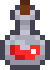
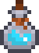

# Project Description

*Catformers* is a 2D platformer-shooter game where 1-2 players control cat characters (Catformers) who leap across platforms and fire bouncing projectiles. Players can select from several unique Catformers with diverse abilities and engage in fast-paced, action-packed combat across multiple game modes.

# Intended usage:

After launching and entering *Catformers*, players are prompted to choose between two game modes: **Versus Mode** and **Boss Mode**.

- In **Versus Mode**, two players compete to deplete each other's lives through strategic movements and precise shots——the last Catformer standing wins.
  - After selecting this mode, players will proceed to a **map selection screen**, where they can choose a themed background——each featuring an unique platform arrangement——or opt for a randomnized stage.
- In **Boss Mode**, players team up or play solo to defeat a powerful, multi-phase boss. Victory is achieved by reducing the boss's health to zero before all players are eliminated.
 - After selecting this mode, players are prompted to choose between **1-player** or **2-player co-op**.
 - Players also have the option to enable 2 toggles at the top right of the screen:
  1. **Demo Mode**: sets lives to **33 lives** in **1-player** and **15 lives** each in **2-player co-op**.
  2. **Story Mode**: adds narrative sequences to Boss Mode, featuring a platforming challenge, additional enemies, and a plotline attached to the boss fight.

Once all selections are made, players are taken to the **character selection screen**, where each player chooses their Catformer using the displayed keyboard controls.

During gameplay, player actions are primarily controlled via the keyboard, with optional mouse controls available in 1-player Boss Mode. The controls for each player are as follows:

## Controls

| Action                    | Player 1                   | Player 2 (if Versus / 2P Boss Mode) |
|---------------------------|----------------------------|-------------------------------------|
| Move Left                 | A                          | ←                                   |
| Move Right                | D                          | →                                   |
| Charge Jump               | Hold W, release to jump    | Hold ↑, release to jump             |
| Crouch                    | S                          | ↓                                   |
| Adjust Aim Angle ↑        | E (tilt aim upward)        | / (tilt aim upward)                 |
| Adjust Aim Angle ↓        | Q (tilt aim downward)      | , (tilt aim downward)               |
| Shoot                     | R                          | .                                   |

### Control Notes & Gameplay Mechanics

- **Mouse Aiming** is enabled in **1-player Boss Mode**.

- **Charge Jump** displays a visible jump bar; the longer you hold before the bar maxes out, the higher you jump.
- **Crouch** reduces your hitbox and movement speed, allowing for dodging or precise movements.
- **Aiming** is reflected by a line coming from the Catformer's mouth. The aim angle never resets and each change must be made manually.
- **Shooting** is subject to a 1 second cooldown time.
  - **Projectiles** bounce **3x** off all walls, platforms, and the floor/ceiling before disapearing.
  - In **Boss Mode** friendly fire and self damage is disabled
  - In **Versus Mode**, players can take damage from their own projectiles if they bounce back.

## General UI & Game Features

**Pause Menu**: Press **SPACE** at any time during gameplay to pause the game.
From the pause screen, players can choose to:
- **Resume** (press SPACE again)
- **Restart** in the current game mode
- **Return** to Start Screen

**HP Indicator**:
- **Players** remaining lives are shown at the top of the screen as heart icons.
- **Boss** and **Enemy** health bars are displayed above their heads.

**Falling**
- In certain maps and modes, bottom platforms are not enclosed, allowing players to fall off the screen.
- This causes players to lose **1 life** and triggers a respawn at their original spawning position.

**Invincibility Frames**:
- Players will gain **3 seconds** of invincibility after respawning from **Falling** off the map.
- The invincibility accounts for all damage recieved besides for falling off the map again.
- Invincbility is indicated by flashing white lines around the player's hitbox.

**Buff Potions**:
- Potions appear every 1000 frames on randomly selected platforms and remain on the map until a player collects them by walking over them.

| Potion Name       | Appearance                                | Effect                                                  | Duration     | Mode(s)            |
|------------------|--------------------------------------------|---------------------------------------------------------|--------------|--------------------|
| **HP Potion**    |          | Restores 1 life (if not at max)                        | Instant      | Versus, Boss       |
| **Mini Potion**  |      | Shrinks hitbox to 50%                                  | 400 frames   | Versus only        |
| **Bullet Potion**|  | Fires 2 extra auto-shots per manual shot               | 400 frames   | Versus only        |
| **Slow Potion**  |      | Slows opposing player to 25% speed                     | 400 frames   | Versus only        |

### Boss Mode: Additional Mechanics

- **Revive** is enabled in **2-player** mode. A defeated player will float upwards and can be revived by the other player by spamming the **jump key 5x** over their hitbox, as indicated by the on-screen text.
  - This feature only works if at least one player remains alive, and the revive must be completed before the floating player leaves the screen. The revived player will respawn at their current position with **1 life**.
- **Traps** require players to **spam keys 10x** to escape (shared in 2-Player Mode) and are indicated with an on-screen warning.
- **Inverse Controls** temporarily **flip left/right movement** and are indicated with an on-screen warning.

## Used Libraries

- **GIFs:** GifAnimation (Patrick M., Jerome SC.)
- **BGM + SFX:** Sound (Processing Foundation)
